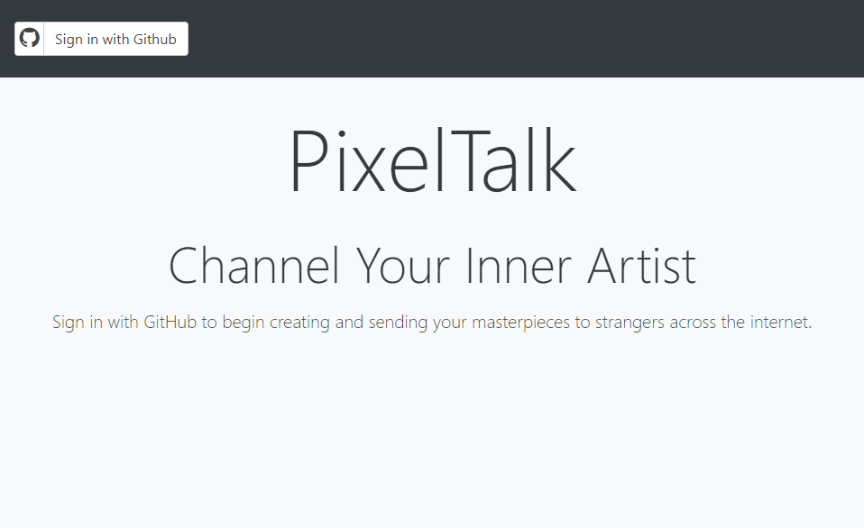

# PixelTalk
Created by:
- Brad Cosma
- Carly Pereira
- Jake Pelrah
- Noah Olson
- Patrick Houlihan

## About the Application

!! ADD LINK TO PROJECT !!

PixelTalk is a webapp that allows users to interact in a unique way...
*talk about promoting communication in a non-verbal way*

### The Login Page
To login click *sign in with GitHub*, and enter your credentials.

### The Inbox Page
After signing in with GitHub users will be greeted by their inbox, a page that shows all users that have sent them a message. Included on this page is the users country flag, profile picture, and username as well as a logout and send drawing button. One of our favorite features on this page is the ability to draw your own profile picture! To do this, click on your profile picture and use the drawing application to complete your portrait.

!! INSERT PIC HERE !!

### The Gallery Page
After clicking on a user in your inbox page, you will be brought to the gallery page. This view shows all messages recieved from that user, as well as their country flag, profile picture, and username. From this page, you can view drawings or click the send arrow to send the current user a drawing.

!! INSERT PIC HERE !!

### The Drawing Page
The drawing application features 9 colors and a size slider. Simply choose a color, brush size and begin drawing! Once the first brush stroke is made, a 20s timer will start. When the timer ends, the drawing will be sent.

!! INSERT PIC HERE !!

## Technologies Outline
- Passport Express Middleware
- Github OAuth
- Bootstrap CSS framework
- BodyParser

## Challenges Faced

## Responsibilities
!! COMMENT !! Feel free to add more detail here, I figured id leave this blank until the project was done
### UI
Carly Pereira & Jake Pelrah

### Server
Brad Cosma & Noah Olson

### Database
Brad Cosma & Noah Olson

### Drawing Application
Jake Pelrah & Patrick Houlihan

## Project Video